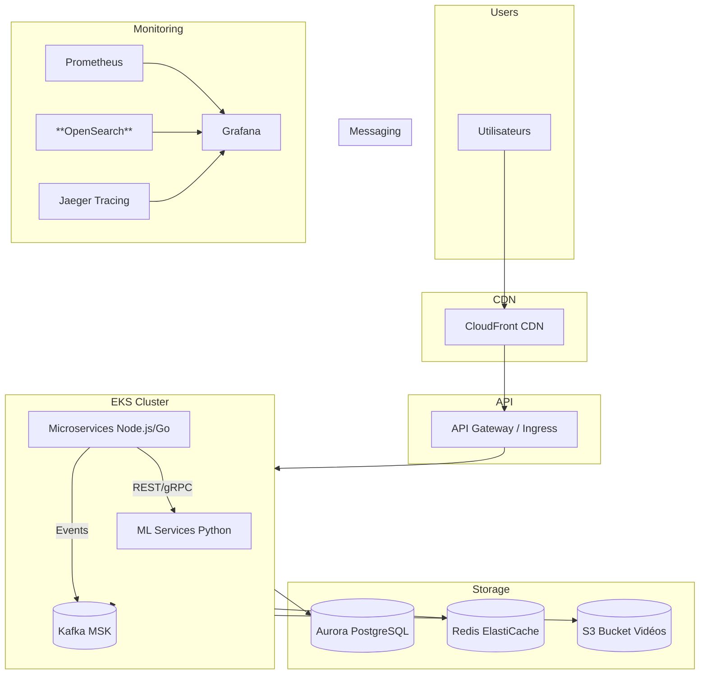
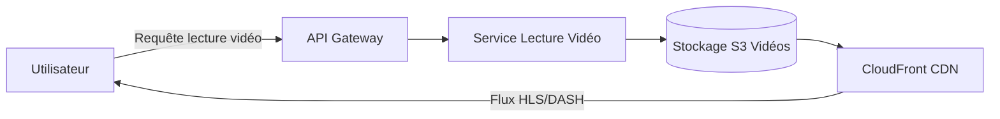
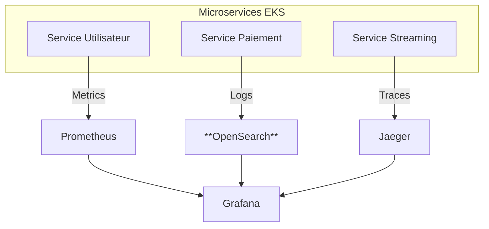

# DAT

# Résumé

Streamify est une plateforme de streaming vidéo visant un volume d'utilisateurs allant de **10 000 à 100 000 clients actifs**. L'architecture proposée est **cloud-native**, microservices, conteneurisée et basée sur des services managés pour minimiser les erreurs opérationnelles et accélérer les déploiements. Les choix technologiques privilégient la maturité, la scalabilité et l'outillage (observabilité, CI/CD, sécurité).

### **Stack recommandée** :

- Front : **React (TypeScript)**
- Backend microservices : **Node.js (TypeScript)** pour la majorité des services, **Go** pour les services haute-performance (transcodage / streaming control) et **Python** pour pipelines Machine Learning
- Orchestration : **Kubernetes (EKS sur AWS)**
- BDD relationnelle : **Amazon Aurora PostgreSQL (RDS)**
- Cache : **Redis (ElastiCache)**
- Messaging/Events : **Apache Kafka (MSK)**
- Object storage : **S3** + **CloudFront (CDN)** pour distribution HLS/DASH
- Observabilité : **OpenTelemetry, Prometheus, Jaeger, Grafana, ELK**

### **Objectifs non-fonctionnels** :

- Disponibilité cible : **99.9%**
- Latence API cible : **p95 < 200ms**
- Résilience : déploiement multi-AZ, reprise partielle en moins de 1h (RTO)
- Sécurité : conformité RGPD, chiffrement en transit & at-rest, délégation PCI au provider de paiement

**Raison du choix AWS & Node.js/Go** : AWS propose un écosystème managé mature (EKS, RDS, MSK, ElastiCache, S3, Kafka, CloudFront) simplifiant l'exploitation à l'échelle visée.

Node.js (TypeScript) offre rapidité de développement et large écosystème ; Go est retenu pour les composants intensifs en I/O et besoin de bas niveau (control plane, transcodage orchestrateur).

Cette combinaison facilite un produit robuste, testable et scalable.

# Couche Fonctionnelle

## 1. Le but

Streamify est une plateforme de streaming vidéo qui propose des films, séries et documentaires, avec des fonctionnalités de recommandation, gestion d’abonnements, paiement, et lecture vidéo.

---

## 2. Utilisateurs du système

Les **abonnés finaux** représentent le cœur de la plateforme. Ils accèdent aux contenus disponibles, utilisent les fonctionnalités de streaming et bénéficient de recommandations personnalisées selon leurs préférences et leur abonnement.

Les **administrateurs et modérateurs** sont chargés de la gestion du catalogue, du suivi des paiements et du contrôle de la qualité du contenu.

En complément, des **services internes**, organisés sous forme de microservices, interviennent pour le traitement et la supervision technique du système.

Une **gestion des habilitations** encadre l’accès aux différentes fonctionnalités. Trois niveaux principaux de rôles sont définis : **utilisateur**, **administrateur** et **super-administrateur**, chacun disposant de droits adaptés à son périmètre d’action.

Le système s’adresse à un **public international**, avec une adaptation automatique de la langue et de la région, et doit pouvoir répondre à une **forte volumétrie d’utilisateurs simultanés**, notamment lors des pics d’audience.

---

## 3. Données manipulées par le système

Les données manipulées par le système se présentent sous différents **formats** selon leur nature :

- **Données utilisateurs** : représentées en JSON, texte ou dates.
- **Vidéos** : fichiers multimédias au format **MP4**.
- **Métadonnées** : stockées sous forme de **JSON** ou dans une **base relationnelle**.

Le **cycle de vie des données** suit les principales étapes suivantes :

- **Création** lors de l’inscription d’un utilisateur ou de l’ajout d’un contenu au catalogue.
- **Modification** lors de la mise à jour d’un profil, d’un abonnement ou des métadonnées associées aux contenus.
- **Suppression** lors de la suppression d’un compte utilisateur ou du retrait d’un contenu obsolète.

Concernant la **sensibilité des données**, le système manipule :

- Des **données personnelles** telles que l’adresse e-mail, le mot de passe ou l’historique de visionnage.
- Des **données financières**, notamment les informations de paiement.

Le **niveau de qualité attendu** est élevé :

- Les **métadonnées** des films et séries doivent être complètes afin de garantir la pertinence des recommandations.
- Les **informations de paiement** doivent être exactes, à jour et systématiquement vérifiées.

Les données sont structurées autour de **référentiels dédiés**, gérés par chaque microservice (Utilisateur, Catalogue, Paiement, Recommandation, …).

Enfin, ces données sont **consommées** par :

- Les **microservices internes** assurant le traitement des fonctionnalités (recommandation, facturation, lecture, etc.).
- Les **interfaces utilisateurs**, permettant l’affichage et l’interaction avec les informations du système.

---

## 4. Traitements à effectuer

Le système s’articule autour de plusieurs **blocs fonctionnels majeurs** :

- **Service Utilisateur** : gestion des comptes, profils, rôles, préférences de localisation et listes de favoris.
- **Catalogue** : administration du contenu multimédia, des sous-titres, des langues et des thématiques associées.
- **Recommandation** : analyse de l’historique de visionnage et génération de suggestions personnalisées.
- **Paiement** : gestion des abonnements, de la facturation et des éventuels remboursements.
- **Lecture Vidéo** : diffusion du contenu via un système de streaming adaptatif, garantissant une expérience fluide selon la qualité de connexion.

Les **types d’usage** du système se répartissent en trois grandes catégories :

- **Consultation** : navigation dans le catalogue et lecture des vidéos.
- **Interaction** : création et modification de profils, ajout de favoris, attribution de notes ou commentaires.
- **Transaction** : souscription ou renouvellement d’abonnements, gestion des paiements et remboursements.

En termes de **performance**, le système doit répondre à des exigences élevées :

- **Temps de réponse rapide** pour la recherche, la navigation et la lecture vidéo.
- **Recommandations personnalisées** calculées en temps quasi réel.
- **Haute disponibilité** et stabilité du service de streaming pour garantir une expérience continue et de qualité.

---

## 5. Interfaces par lesquelles transitent les données

Le système communique avec plusieurs composants internes et externes :

- **Services internes (microservices)** : gestion des utilisateurs, paiements, catalogue, recommandations, notifications et lecture vidéo.
- **Services externes** : intégration avec les passerelles de paiement et les fournisseurs de contenu.

Le **sens des échanges** est principalement :

- **Bidirectionnel** entre les utilisateurs et les services applicatifs.
- **Interne**, entre microservices, pour assurer la synchronisation des données et le traitement distribué des opérations.

Les **formats d’échange** reposent sur :

- Des **API REST ou GraphQL**, utilisant le format **JSON** pour les données applicatives.
- Des **flux de streaming vidéo** diffusés via les protocoles **HLS** ou **MPEG-DASH**.

Les **principales problématiques à anticiper** concernent :

- La **cohérence des données** entre microservices.
- La **gestion des erreurs** et des **latences réseau**.
- La **sécurisation et l’authentification** des flux d’échange.

# Applicatif

## 1. Le but

La couche applicative décrit les aspects techniques concrets du fonctionnement de Streamify, en se concentrant sur :

- Les flux : protocole, fréquence, sens
- Les gisements de données : types, volumes, durée de conservation
- Les middlewares : bases de données, serveurs d’application, composants de sécurité
- Les frameworks et langages : technologies utilisées pour le développement

Cette couche permet de comprendre comment les microservices communiquent, stockent et traitent les données.

---

## 2. Identification des flux

| **Flux** | **Protocole** | **Sens** | **Taille / Débit** | **Fréquence** | **Temps de réponse** | **Parcours** |
| --- | --- | --- | --- | --- | --- | --- |
| Authentification utilisateur | HTTPS | Client → Serveur | 1-10 Ko | À chaque login | < 500 ms | Internet → DMZ → Backend |
| Consultation catalogue | HTTPS | Client → Serveur | 50 Ko - 2 Mo | Selon navigation | < 1 s | Internet → DMZ → Backend |
| Streaming vidéo | HLS | Serveur → Client | 2-10 Mbps | Continu | Temps réel | CDN → Internet → Client |
| Recommandation personnalisée | HTTPS | Client → Serveur | 10-50 Ko | À chaque chargement | < 500 ms | Internet → DMZ → Backend |
| Notification push | HTTPS / MQTT / WebSocket | Serveur → Client | 1-5 Ko | Selon événement | < 1 s | Backend → Internet |

---

## 3. Identification des gisements de données

- Utilisateur et profil : SQL / JSON, conservation 5 ans, accessible par microservice utilisateur, purge comptes inactifs et anonymisation
- Historique de visionnage : NoSQL / JSON, conservation 2 ans, accessible par microservice recommandation et analytics, purge automatique
- Catalogue de contenu : SQL + fichiers, permanent, accessible par frontend et microservice recommandation, mise à jour régulière
- Paiement et facturation : SQL sécurisé, 10 ans, accessible par microservice paiement et audit, conforme aux normes légales
- Logs et monitoring : JSON / fichiers, 6 mois, accessible par DevOps, rotation automatique
- Notifications : Queue / cache, 7 jours, accessible par service notification, purge automatique

---

## 4. Identification des middlewares

- Échanges et messaging : Kafka
- Bases de données : PostgreSQL pour utilisateur et catalogue, Redis pour cache et sessions
- Serveurs d’application et web : NGINX + microservices Node.js/Go pour reverse proxy et load-balancer, CDN pour distribution vidéo
- Sécurité réseau : Firewall niveau 4, WAF, VPN interne pour communication inter-services, Bastion pour accès administrateur, Authentification OAuth 2.0 / JWT / SSO

---

## 5. Frameworks, langages et packages

- Backend : Node.js, Go pour microservices
- Frontend : React (Web), React Native (Mobile)
- Bases de données : PostgreSQL, Redis
- Messaging : Kafka
- Serveurs web : Nginx
- Auth / SSO : OAuth 2.0, JWT

Critères de choix : popularité et communauté active, sécurité robuste, interopérabilité avec microservices existants, courbe d’apprentissage adaptée à l’équipe, écosystème riche, open-source ou coût faible.

# Infrastructure

## 1. Environnement d’hébergement

L’infrastructure repose sur le **cloud public AWS (Amazon Web Services)**, choisi pour la richesse de son écosystème managé incluant **EKS**, **RDS**, **S3** et **MSK** ainsi que pour ses capacités de **scalabilité automatique** (Auto Scaling Groups, Kubernetes HPA) et sa **disponibilité multi-zones** (Multi-AZ).
L’intégration native avec **CloudFront (CDN)** permet d’assurer une diffusion vidéo performante et mondiale.

Le déploiement est entièrement **multi-AZ** afin de garantir la **résilience** et la **tolérance aux pannes** du système.

L’architecture repose sur la **conteneurisation et l’orchestration** des microservices, assurant une grande portabilité, une montée en charge fluide et des déploiements rapides et maîtrisés.

## 2. Conteneurisation & Orchestration

Chaque microservice **Node.js** est conteneurisé au sein d’une image **Docker**, garantissant une portabilité et une cohérence entre les environnements.

L’orchestration est assurée par **Kubernetes (EKS)**, qui prend en charge le **déploiement**, la **montée en charge automatique**, la **gestion des rollbacks** et la **résilience** grâce à la réplication des pods et à la supervision continue des services.

Un **Service Mesh** tel qu’**Istio** complète l’infrastructure en apportant des fonctionnalités avancées d’**observabilité**, de **sécurité** via le chiffrement **mTLS**, et de **gestion fine du trafic** entre microservices.

## 3. Réseau & Communication

L’exposition des interfaces se fait via une **API Gateway**, assurée par **AWS API Gateway** ou, selon le besoin, par un **NGINX Ingress Controller** déployé dans Kubernetes.

La **communication interne** entre microservices repose sur des échanges **REST** ou **gRPC** pour les interactions synchrones, et sur **Kafka (AWS MSK)** pour la messagerie asynchrone et la gestion des événements critiques tels que les paiements, les recommandations ou la journalisation.

L’équilibrage de charge est géré par **AWS Elastic Load Balancer (ELB)**, garantissant une répartition efficace du trafic entre les nœuds Kubernetes.

Enfin, la diffusion des contenus vidéo s’appuie sur le **CDN CloudFront**, permettant une distribution rapide et fiable grâce à la mise en cache géo-répliquée à proximité des utilisateurs.

## 4. Stockage & Bases de données

Les **données transactionnelles** telles que les informations utilisateurs, abonnements et facturation sont gérées par **PostgreSQL (RDS)**.

Pour les besoins de **performance et de cache**, **Redis** est utilisé, notamment pour les sessions, les tokens et les recommandations rapides.

Les contenus multimédias et autres assets sont stockés dans **Amazon S3**, offrant une solution **résiliente et scalable**.

Les mécanismes de **sauvegarde** incluent des **snapshots automatisés** pour RDS ainsi que la **réplication cross-region** pour les données S3, assurant protection et disponibilité.

## 5. Dimensionnement initial (scalabilité prévue)

Le **cluster Kubernetes** est composé de 6 nœuds (t3.medium) et peut être étendu automatiquement grâce au **Horizontal Pod Autoscaler (HPA)** pour répondre aux variations de charge.

Le **cluster Kafka** comprend 3 brokers déployés en **multi-AZ** pour garantir la haute disponibilité et la résilience des flux d’événements.

Les **bases de données** sont organisées pour la performance et la disponibilité :

- **PostgreSQL (RDS Multi-AZ)** avec des **read replicas** pour supporter la scalabilité en lecture.
- **Redis cluster** pour le cache distribué et les accès rapides aux données temporaires (sessions, tokens, recommandations).

Le **CDN CloudFront** assure une **distribution mondiale** des contenus multimédias avec un cache géo-répliqué proche des utilisateurs, garantissant performance et faible latence.

## 6. Politique de sauvegarde & PRA

Les **sauvegardes** sont organisées pour garantir la protection et la disponibilité des données :

- **RDS** : snapshots quotidiens avec rétention de 30 jours.
- **S3** : versioning activé et réplication **cross-region** pour assurer la résilience des contenus et assets.

Le **Plan de Reprise d’Activité (PRA)** repose sur un redéploiement automatisé via **Terraform** et **Helm charts**, avec des objectifs de RTO inférieur à 1 heure et de RPO inférieur à 15 minutes.

La **continuité des services (PCA)** est assurée par la réplication multi-AZ des composants critiques tels que l’authentification, la facturation et le streaming, ainsi que par des mécanismes d’**auto-scaling** pour gérer les pics de charge.

# Opérationnel

## 1. Intégration et deploiement continus (CI/CD)

Afin d'assurer l'**évolutivité** et le **déploiement continu et indépendant des microservices**, le processus de livraison est entièrement automatisé.

Le cycle commence avec l'**Intégration Continue (CI)** : chaque modification de code déclenche automatiquement le pipeline.

Celui-ci exécute systématiquement les tests unitaires et d'intégration, puis procède à une **analyse de la qualité et de la sécurité** via **SonarQube**.
SonarQube évalue la dette technique, la couverture de tests et effectue le *Security Static Analysis Testing* (**SAST**). Le Microservice ne peut être déployé qu'à la condition de respecter les seuils de qualité définis par une **'Quality Gate'**, garantissant ainsi que seule une image Docker validée, sécurisée et de haute qualité est envoyée au registre privé.

Le **Déploiement Continu (CD)** adopte une approche **GitOps** à l'aide d'outils comme **ArgoCD** ou **Flux**. Cette méthode assure la traçabilité des configurations de production en les traitant comme l'unique source de vérité versionnée dans Git.

Deux stratégies de déploiement sont utilisées :

- Le **Rolling Update (Mise à Jour Glissante)** est la stratégie par défaut, remplaçant progressivement les anciennes instances pour maintenir le service sans interruption.
- Le **Blue/Green** est réservé aux mises à jour critiques.
  Cette approche permet un **basculement rapide** du trafic vers la nouvelle version et offre un **rollback instantané** en cas de problème.

Enfin, la **gestion des secrets** (clés API, identifiants de bases de données) est centralisée dans un coffre-fort Cloud sécurisé (ex : Vault) et injectée de manière dynamique et sécurisée dans les conteneurs au moment de l'exécution.

## 2. Observabilité

### Télémétrie unifiée

La plateforme de télémétrie s'articule autour du standard **OpenTelemetry**, adopté dès le début pour l'**instrumentation** des microservices, car il standardise l'émission des métriques, logs et traces.

**Grafana** est choisi comme l'outil de **supervision** et de visualisation principal. Son rôle est central puisqu'il permet de **corréler les trois sources de données** :

1. **Metrics** : Collectées par **Prometheus**, elles assurent le **monitoring** des performances (débit, latence P95).
2. **Logs** : Agrégés et stockés dans une stack ELK.
3. **Traces Distribuées** : Stockées et analysées par **Jaeger**.

Cette capacité de **croisement des logs, metrics et tracing** dans Grafana est critique pour réduire le **temps moyen de résolution**, car les ingénieurs peuvent passer directement d'une alerte de métrique à la trace de la requête défaillante, puis aux logs associés.

### Alerting

L'**alerting** est configuré pour se déclencher uniquement lorsque les **Objectifs de Niveau de Service (SLO)** sont menacés.

Le système d'alerte (Alertmanager) utilise les métriques Prometheus et notifie les équipes d'astreinte, garantissant qu'elles sont mobilisées pour les seuls problèmes qui affectent réellement les utilisateurs.

## 3. Continuité et gestion des incidents

L'objectif de **résilience** est atteint par la mise en place de **Patterns de Résilience** (comme les **Circuit Breakers**) qui isolent la défaillance d'un service.

La **Gestion des Incidents** est une procédure formelle :

1. **Détection** : L'alerte se déclenche (souvent basée sur les métriques Prometheus).
2. **Diagnostic** : Utilisation des logs centralisés et des dashboards pour identifier le microservice en cause.
3. **Résolution** : L'équipe suit des **Runbooks** (procédures de résolution documentées) pour appliquer rapidement les correctifs ou initier un **rollback**.

La **Continuité d'Activité** est assurée par le déploiement en **Multi-AZ** pour tolérer les pannes d'infrastructure, soutenu par une politique de **sauvegarde** des données transactionnelles (PostgreSQL).

